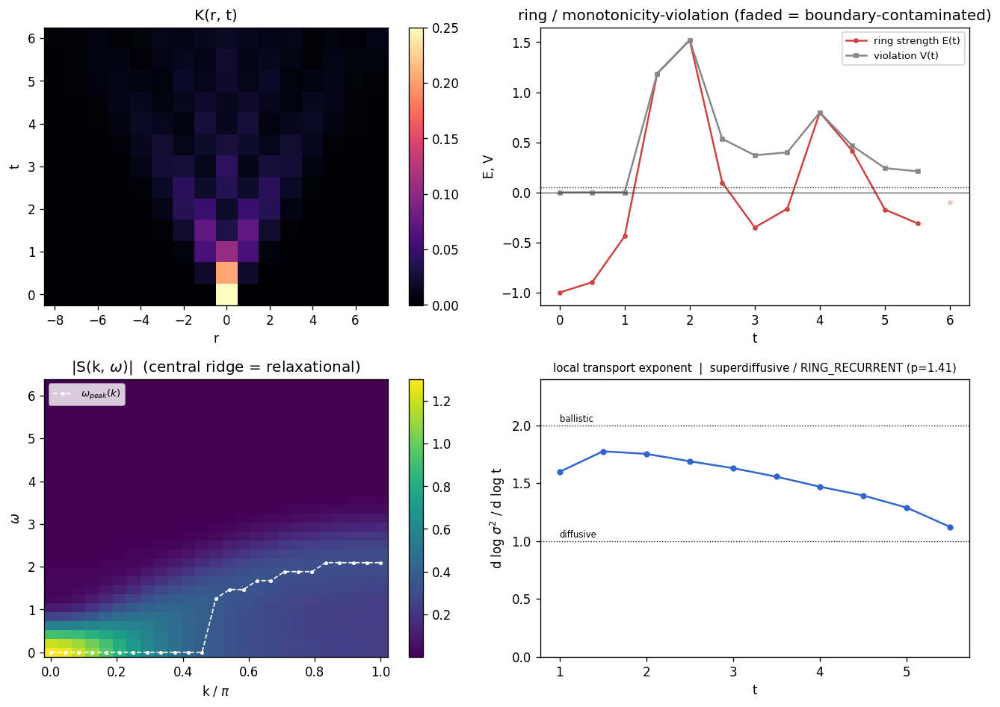
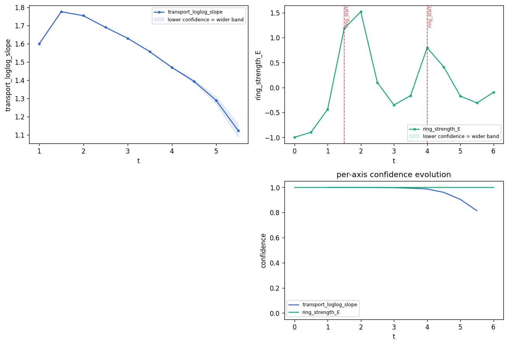

# Kernel Dynamics Viewer (v0.8)

A small Python toolkit for **regime diagnostics of spatiotemporal kernels**
`K(r, t)` from non-equilibrium many-body systems (quantum or classical).

You measured or simulated a dynamic correlation function
`K(r, t) = <O(r, t) O(0, 0)>` — a spreading profile over space and time.
This tool turns it into a small set of **measurable shape features** and a
**two-axis regime classification**, with publication-style plots, in one
command:

```
kernel-viewer analyze data.npz
```

No theory, no interpretation — only numerical shape descriptors.

## What it computes

| feature | definition | meaning |
|---|---|---|
| transport exponent `p` | late-window slope of `log sigma^2(t)` vs `log t`, boundary-contaminated tail excluded | 1 = diffusive, 2 = ballistic |
| unimodality score | `1 / n_peaks` of the symmetrized profile (prominence-filtered) | 1.0 = single peak |
| ring strength `E(t)` | `(max_{r>0} K - K(0)) / K(0)` | > 0: the maximum sits off the source |
| violation `V(t)` | strongest positive step of the profile, relative to `K(0)` | 0 = monotone profile |
| tail shape | gaussian / exponential / power-law, decided on the **outer half** of the profile via log-log curvature | power-law = heavy (Levy-like) tail |
| `S(k, omega)` | double cosine transform (Hann window) | central ridge = relaxational, off-axis ridge = propagating |

## Two-axis classification

**Axis 1 — transport** (from the exponent + tail):
`DIFFUSIVE / SUPERDIFFUSIVE / BALLISTIC / SUBDIFFUSIVE / LEVY`

**Axis 2 — coherence** (from the ring history `E(t)`):
`MONOTONE / RING_TRANSIENT / RING_PERSISTENT / RING_RECURRENT`

The axes are deliberately independent, because they are in the data:
ballistic kernels can be unimodal, and diffusive systems can show transient
rings. "Chaotic vs integrable" is typically an **axis-2** distinction
(transient vs recurrent rings), not an axis-1 one — that is why there is no
`CHAOTIC` transport class.

Two failure modes this design avoids:
- `unimodality ~ 1` does **not** imply diffusive (early ballistic kernels are
  unimodal too) — transport is read from `sigma^2(t)`, never from peak counts;
- `sigma^2 ~ t` does **not** rule out Levy (for power-law tails the second
  moment is dominated by the finite window) — heavy tails are detected
  separately and promote the regime to `LEVY`.

## Quickstart

```bash
pip install numpy scipy matplotlib
python -m kernel_viewer.cli demo            # 4 synthetic kernels -> reports + dashboards
python -m kernel_viewer.cli analyze examples/xxz_Sx_integrable.npz
python -m kernel_viewer.cli classify examples/ising_q_chaotic.npz -o report.json
```

Data format: `.npz` with `K` plus optional axes — **1D**: `K (T, R)` with
`r (R,)`, `t (T,)`; **2D**: `K (T, Y, X)` with `x (X,)`, `y (Y,)`, `t (T,)`;
**3D**: `K (T, Z, Y, X)` with `x`, `y`, `z`, `t`; **4D**: `K (T, W, Z, Y, X)`
with `x`, `y`, `z`, `w`, `t`. The **time axis is always first**. (Bare `.npy` works too; integer axes are then assumed.) The loader
dispatches on dimensionality automatically — no `--dim` flag is needed.

```python
from kernel_viewer import load_kernel, classify
rep = classify(load_kernel("data.npz"))
print(rep.summary())
```

## Input formats (v0.8)

`load_any` reads four formats and returns the same `Kernel*` objects regardless
of source, so the CLI accepts any of them (`kernel-viewer classify data.mat`):

| format | reader | notes |
|---|---|---|
| `.npz` / `.npy` | `numpy` | the native format (above); `load_any` delegates to `load_kernel` unchanged |
| `.mat` | `scipy.io.loadmat` | reads `K` (or the highest-dimensional non-private array) plus optional `t` and `r`/`x`/`y`/`z`/`w`. MATLAB is column-major and often stores **time last** (`(R, T)`, `(X, Y, T)`); the time axis is detected from the coordinate lengths and moved to axis 0. Pass `time_axis='first'` or `'last'` when the autodetect is ambiguous (it warns). |
| `.csv` / `.txt` | `numpy.genfromtxt` | **1D kernels only.** `layout='matrix'` — a `(T, R)` grid; a `NaN` top-left corner marks a *labelled* grid with `r` along the first row and `t` down the first column. `layout='long'` — three columns `t, r, K`. Multi-dimensional kernels can't live unambiguously in a flat CSV and raise `NotImplementedError`; use `.npz`/`.mat`. |

```python
from kernel_viewer import load_any, classify_any
rep = classify_any(load_any("data.mat", time_axis="last"))
print(rep.summary())
```

## GUI (v0.8)

A Streamlit app turns the whole pipeline into a drag-and-drop dashboard:

```bash
pip install -e ".[gui]"             # Streamlit is an optional extra
streamlit run app/streamlit_app.py
```

Drop in a kernel (`npz/npy/mat/csv`) and the app runs the full analysis: the
regime summary (the exact `classify_any` text), the dimension-appropriate
matplotlib dashboard, and the **stateflow** axis timelines (continuous
transport slope and coherence `E(t)`) with the detected transitions. The
sidebar exposes the two real knobs — `ring_threshold` and `edge_limit` — at
their library defaults; nothing is auto-tuned. The core install stays
`numpy + scipy + matplotlib`; Streamlit is never imported by the library or the
core test suite.

| regime dashboard | stateflow axes |
|---|---|
|  |  |

*Planned (not in v0.8): Plotly interactivity, a `K(r, t)` time-slider
animation, and multi-file comparison — see [`app/README.md`](app/README.md).*

### Deploy (Streamlit Community Cloud)

The app deploys on [Streamlit Community Cloud](https://share.streamlit.io) with
no extra setup: point a new app at **`app/streamlit_app.py`** on the **`main`**
branch. Dependencies install from the repo-root **`requirements.txt`** (the
package + its `gui` extra; `runtime.txt` pins Python 3.12). The app resolves the
bundled `examples/*.npz` from its own file location, so the example dropdown
works in the cloud sandbox. Every push to `main` triggers an automatic redeploy.

## 2D kernels

2D input `K(x, y, t)` is handled by **radial reduction with full-2D moments**:

- transport moments (`sigma^2`, edge fraction, conservation) are computed on
  the full 2D array — radially averaged profiles would miss the `r dr`
  measure;
- shape metrics (unimodality, ring, violation, tail) run on the radially
  averaged profile `P(r, t)`, binned in unit annuli **up to the inscribed
  circle only** (square-window corners sample angles unevenly);
- two anisotropy diagnostics are added: the covariance anisotropy `A(t)`
  (quadrupole; blind to 4-fold patterns) and the angular harmonic `c4(t)`
  computed on pixels with `r >= 2` (the nearest-neighbour shell of a square
  lattice is itself 4-fold and would fake `c4 ~ 1` for any narrow kernel).

**Coherence axis reads differently in 2D.** A propagating mode's wavefront is
a circle, so `RING_*` on the radial profile means "a coherent propagating
front is present" — generic for wave-like transport in 2D, and **not** by
itself a sign of integrability (that reading was calibrated on 1D chains).

```bash
python -m kernel_viewer.cli demo2d   # 6 cases incl. an MC random walk and a lattice wave equation
python -m kernel_viewer.cli analyze examples/wave2d_lattice.npz
```

`examples/wave2d_lattice.npz` (leapfrog 2D wave equation: circular front,
C4 lattice anisotropy, interference recurrences) and
`examples/randomwalk2d_mc.npz` (200k-walker Monte-Carlo diffusion with real
sampling noise) are dynamically generated, not closed forms.

## 3D kernels (v0.3)

3D input `K(x, y, z, t)` follows the 2D design: **spherical-shell radial
reduction with full-3D moments** (`sigma^2 = <x^2+y^2+z^2>`, verified
`= 6 D t` exactly on Gaussian ground truth), statistics up to the inscribed
sphere only, and true voxel bin counts carried with the profile. Anisotropy
diagnostics: **FA(t)** (fractional anisotropy of the covariance, DTI
convention; blind to cubic patterns) and **Q4(t)** `= <n_x^4+n_y^4+n_z^4> -
3/5` on voxels with `r >= 2` (+0.4 = axis-aligned; the nearest-neighbour
shell of a cubic lattice is 6-fold and would fake `Q4 = +0.4` for any narrow
kernel). Reports include `dimensionality` and `isotropy_score`.

```bash
python -m kernel_viewer.cli demo3d
python -m kernel_viewer.cli analyze examples/randomwalk3d_mc.npz
```

Memory note: `K (T, Z, Y, X)` is held as float64 in RAM — a `13 x 41^3`
kernel is ~90 MB. Store float32 on disk and keep `L` moderate.

## S(k, omega) for isotropic 2D/3D kernels (v0.3)

`spectrum` now works for 2D and 3D via the dimensionally correct radial
transform — **Hankel (`J0`)** in 2D and **spherical Bessel
(`j0 = sin(x)/x`)** in 3D — weighted by the true lattice bin counts (more
faithful than the continuum `2 pi r dr` / `4 pi r^2 dr` measure on small
grids), followed by the windowed cosine transform in time:

```bash
python -m kernel_viewer.cli spectrum data_2d.npz   # no flag needed
```

Validated against the exact Gaussian symbol `C(k,t) = W exp(-D k^2 t)` to
**~10%** (integer-bin discretization). **Isotropy is assumed**: the command
prints the `isotropy_score` and warns below 0.9; anisotropic vector-`k`
spectra are NOT implemented.

## Unified structure-factor API (v0.4)

```python
from kernel_viewer.metrics.fourier import compute_structure_factor
sp = compute_structure_factor(kernel)        # Kernel / Kernel2D / Kernel3D
sp.transform_type   # "cosine" / "hankel_j0" / "spherical_bessel_j0"
sp.warnings         # e.g. anisotropy warning (radial S mixes directions)
```

One entry point dispatching to the dimensionally correct transform, with the
isotropy check built in (below `isotropy_threshold=0.9` a warning is
attached). `save_spectrum()` writes `k, omega, S_kw, transform_type` to
`.npz`; `plot_structure_factor()` adds the dispersion overlay.

**Physics validation** (in the test suite): for a moving-shell kernel the
dispersion `omega_peak(k) = v k` is recovered — 2D slope within ~11% of the
true `v` (corr 0.998). **3D caveat**: a sharp shell's radial transform is
`j0(kvt) ~ sin(kvt)/(kvt)`; the `1/t` surface-dilution envelope turns
`S(k, omega)` into a **plateau with an edge** at `omega = v k`, so the peak
estimator is linear in `k` but systematically *below* `v` (textbook, not a
bug). Kernels built from rectified amplitudes (`|u|`, e.g. the bundled
`wave2d_lattice`) carry **no phase information** — their dispersion cannot be
recovered from `S(k, omega)` at all.

## 4D kernels (v0.5)

4D input follows the same design: **hyperspherical-shell radial reduction
with full-4D moments** (`sigma^2 = <x^2+y^2+z^2+w^2>`, verified `= 8 D t`
exactly: `2 d D t` with `d = 4`), inscribed hypersphere only, true voxel bin
counts (shell occupancy grows `~ 2 pi^2 r^3`). Anisotropy: generalized
**FA** (`sqrt(d/(d-1) ...)`) and **Q4** `= <sum n_i^4> - 3/(d+2)` `=
<...> - 1/2` (+0.5 = axis-aligned; the 8-fold nearest-neighbour shell is
excluded via `r >= 2` as in 2D/3D). `S(k, omega)` uses the d=4 zonal basis
`2 J1(kr)/(kr)` ("generalized_hankel_j1"), validated against the exact
Gaussian symbol to ~4%.

```bash
python -m kernel_viewer.cli demo4d
```

**Physics note — wavefront dilution vs dimension.** A sharp ballistic front
dilutes as `1/r^{d-1}`: in 4D the source-site value of a shell kernel dies
as `~ t^{-3}` and the radial transform's oscillation envelope decays
`~ t^{-3/2}`, so `S(k, omega)` front edges are even softer than the 3D
plateau and `omega_peak` underestimates the front velocity more strongly.
Practically: front kernels in high `d` have very short clean windows (the
E/V underflow masking and edge-fraction guards do the bookkeeping), and a
true ballistic shell can read as superdiffusive if the window only covers
the width transient `sigma^2 = (vt)^2 + w^2`. Diffusive classification is
unaffected (`sigma^2 ~ t` is dimension-independent); the return probability
`K(0,t) ~ t^{-d/2}` just decays faster.

## Sliding-window regime tracking (v0.6)

```bash
kernel-viewer track data.npz --window 28 --stride 6
```

`track_regimes(kernel, window, stride)` classifies rolling time windows and
flags windows where the **coherence class changes** -- e.g. a
broadband/monotone kernel developing a long-lived recurrent coherent mode.
This is generic change detection: the reliable signal is the coherence axis;
the transport exponent inside a short window is indicative only, and a window
must span >= 2 oscillation periods before RING_RECURRENT can be called. The
synthetic `coherent_onset2d` model and a regression test pin this behavior.

## Bundled real data

`examples/` ships four kernels **measured by exact dynamical typicality**
(sparse Krylov, no tensor-network truncation) on quantum spin chains:

| file | system | classifier output |
|---|---|---|
| `xxz_Sz_diffusive.npz` | XXZ Delta=1.5, conserved Sz, N=16 | superdiffusive (p=1.21, still descending toward diffusion), MONOTONE |
| `xxz_Sx_integrable.npz` | same chain, non-conserved Sx | RING_RECURRENT (integrable revivals) |
| `ising_q_chaotic.npz` | tilted-field Ising energy density, N=12 | RING_TRANSIENT (chaotic: the ring heals) |
| `longrange_Sz_a1.5.npz` | long-range XXZ alpha=1.5, conserved Sz, N=16 | ballistic-window + RING_RECURRENT (prethermal coherence) |

These four span the coherence taxonomy with real quantum data and double as
regression tests.

## Cross-library check (yupi) (v0.9)

An ensemble of walkers all starting at the origin **is the propagator** of the
process, so histogramming their positions at each time *is* a kernel `K(r, t)`.
The check uses [`yupi`](https://pypi.org/project/yupi/) — an independent
trajectory library — to generate 2D Brownian motion, converts the ensemble to a
kernel with `kernel_viewer.io.trajectories.ensemble_to_kernel2d`, and confirms
kernel-viewer classifies *someone else's* implementation correctly. Getting an
independent process right is a **cross-library consistency check, not a
tautology** — that is the scientific value.

```bash
kernel-viewer classify examples/yupi_randomwalk2d.npz    # diffusive / MONOTONE / p~1.0
```

The bundled npz is committed, so this runs with no extra install. To regenerate
it (and catch yupi-API drift):

```bash
pip install -e ".[examples]"
python examples/generate_yupi_examples.py
```

**Heavy-tailed (Lévy) processes are intentionally out of scope** for this
cross-check. A square-lattice kernel clips the heavy tail, and a tail-preserving
radial profile blows `Rmax` up into a many-bin kernel that is slow to classify
and whose tail-shape verdict is not robust (keep the whole tail and it reads
`levy` but is unusably slow; truncate it for speed and it flips to
`superdiffusive`). Lévy / anomalous-diffusion detection is a mature field with
dedicated tools (MSD-exponent fits, van Hove functions, `scipy.stats.levy_stable`,
yupi's own analysis) — use those rather than this kernel's tail-shape heuristic.

The conversion helpers take plain NumPy arrays `(N_walkers, T_steps, D)` and
build the **existing** `Kernel`/`Kernel2D` objects — they add no diagnostics and
**import no yupi** (only the example script does), so the core install stays
`numpy + scipy + matplotlib`.

## Honest limitations

- 1D and 2D kernels on uniform grids only (no 3D, no irregular sampling).
- 2D: radial bins at small `r` contain few pixels (noisy `P(0)`, `P(1)`);
  statistics stop at the inscribed circle, so the usable radial range is
  `min(Lx, Ly)/2`; strongly anisotropic kernels make the radial profile a
  mixture of directions — ring/monotonicity calls then carry a warning but
  can still be smearing artifacts; `S(k, omega)` is **not** implemented for
  2D (the radial transform is a Hankel, not a cosine, transform).
- 2D/3D/4D memory: kernels are held in RAM as float64 (store float32 on
  disk). 4D is large: an `11 x 25^4` kernel is ~34 MB plus distance grids;
  keep `L <= ~25`. The inscribed-hypersphere radial range is short
  (`r_max = L//2`), so 4D tail discrimination often returns `UNKNOWN`.
- Radial `S(k, omega)` assumes isotropy and carries ~10% binning accuracy;
  anisotropic spectra are not implemented. Frequency resolution is
  `~ pi / t_max` in all dimensions.
- 3D ballistic shells: the width transient `sigma^2 = (vt)^2 + w^2` biases
  short-window exponents downward — slow fronts in small boxes can read as
  superdiffusive.
- `E(t)` and `V(t)` are normalized by `K(0, t)`: for oscillatory kernels the
  source-site value passes through zero (wave nodes) and both spike — read
  the **episode structure**, not the spike magnitudes.
- The transport exponent is the exponent **of your time window** — short
  windows report transients (the bundled XXZ data is a documented example).
- `S(k, omega)` resolution is `~ pi / t_max`: short series give coarse
  frequency peaks.
- Tail discrimination needs spatial range; profiles with < ~6 usable radii
  return `UNKNOWN`.
- Boundary effects are flagged via the edge fraction (default cut 0.3) and
  excluded from fits, but small systems simply have small clean windows.
- yupi cross-check: only the **random walk** is bundled (`yupi_randomwalk2d.npz`,
  committed, so the file-based test is the source of truth and never depends on
  regenerating identical randomness). **Lévy is intentionally out of scope**
  (v0.9.1): a square-lattice histogram clips the heavy tail, and a tail-preserving
  radial profile is slow (large `Rmax` → many bins) and not a robust Lévy
  detector — use dedicated anomalous-diffusion tools instead. The
  `ensemble_to_radial_kernel` helper remains as a general (isotropic, 1D) utility.

MIT license.
